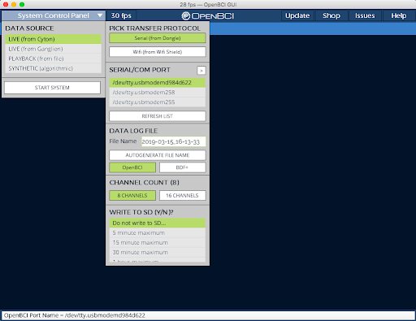
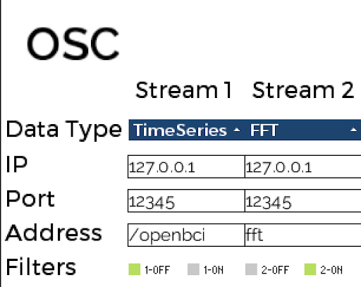

# Data Collection

## Required equipment
* Measuring tape
* [Head marker](https://www.uline.ca/Product/Detail/S-17462R/Markers-and-Pens/Sharpie-China-Markers-Red?pricode=YE731&gadtype=pla&id=S-17462R&gclid=Cj0KCQjwtMvlBRDmARIsAEoQ8zTQJZnP6G0zHH-9TAcVlKNOleufHNOmLClhWkHzrrbr6X2QLbNuPxMaAm8jEALw_wcB&gclsrc=aw.ds)
* [OpenBCI board](https://shop.openbci.com/products/cyton-biosensing-board-8-channel?variant=38958638542)
* [Gold cup electrodes](https://shop.openbci.com/collections/frontpage/products/openbci-gold-cup-electrodes?variant=9056028163)
* [Electrode gel](https://bio-medical.com/ten20-eeg-conductive-paste-4oz-jars-3-pack.html)
* Laptop

## Electrode placement

1. Have the participant remove any earrings, necklaces, glasses (can replace later if need for seeing screen) and untie hair.
2. Measure the distance between the two ears (Y). Take note of and mark the following using the head marker while holding the measuring tape in the same position:
    * Mid-point between both ears
    * 10% of Y as measured from the midpoint (i.e. 40% and 60% of Y, as measured from one of the ears)
    * 20% of Y as measured from the midpoint (i.e. 30% and 70% of Y, as measured from one of the ears)
3. Measure the distance between the nasion (the dip between the forehead and the nose) and the inion (the bump where the skull dips inwards at the back of the head) (X). Take note of and mark the following as described in #1:
    * Mid-point between the nasion and inion
4. Find the intersection between the mid-point of X and Y. This is Cz, the center of the head. Place the headmarker over this spot and do a sanity check. Is it between the two eyes? Does it look like the center of the head?
5. Place C1, C2, C3 and C4 (see diagram - _respect the colors on the diagram_).
    * These should fall along the same line as Cz. You may need to move the lines you measured in step #1.
6. Place the references on the ear lobes. 
    * White = SRB port = left
    * Black = BIAS port = right
    * Secure with electrical tape if needed.
7. If measuring heart rate, place an electrode on the left wrist. 
    * Secure with electrical tape if needed.
    
## Setting up the OpenBCI board
1. Turn on the board (PC mode).
2. Connect electrodes to the bottom pins (note: top pins are references, don’t need to worry about them):
    * Connect white cable to SRB2 (reference).
    * Connect black cable to BIAS (ground).
    * Connect other electrodes (in order). 
    * Connect dongle to USB port of laptop

## Launching the OpenBCI GUI and troubleshooting 
1. Install [OpenBCI GUI](https://openbci.com/index.php/downloads) and [FDTI VP driver](https://www.ftdichip.com/Drivers/VCP.htm).
Launch the OpenBCI GUI.
2. Select Data Source > LIVE (from Cyton) > Serial (from Dongle) > usually the FDTI driver is the first port on the Serial/COM port list > START SYSTEM

3. Set OSC to the following settings:

4. Start both the OSC and Data Stream.
5. Troubleshooting if electrodes are RAILED OR if amplitudes are higher than 5-6 uV\*rms
    * Make sure all electrodes are sticking well, with no hair under the electrode. If they aren’t sticking well, try using abrasive and more paste.
    * Replace the references.
    * Make sure wires aren’t tangled.
    * Reduce the tension in the wires by placing the BCI closer to the level of the participant’s head. 
  
## Launch the dashboard
1. See [Dashboard folder](https://github.com/NTX-McGill/NeuroTechX-McGill-2019/tree/master/src/dashboard) for instructions.

## Collecting training data
1. Explain to the participant what they need to do. Make sure they are well positioned (feet on the ground, no tension in legs or arms, arms comfortably rested on lap or on table). 
2. Queue your sequence in the dashboard. We want to collect the following sequences:
    * 20 sec rest, 20 sec left, 20 sec right (motor imagery)
    * 20 sec rest, 10 sec left, 10 sec right (motor imagery)
    * 20 sec rest, 5 sec left, 5 sec right (motor imagery)
    * 20 sec rest, 3 sec rapid eye blinking
    * Resting heart rate and if possible increased heart rate while watching horror movie trailer or something stressful
3. For each sequence, name the trial in an informative way on the dashboard. You do not need to restart the OpenBCI GUI each time, but make sure to save the OpenBCI text file at the end and note down which trials are associated with which text file.
4. Having trouble finding where your data is saved? You need to save both the OpenBCI raw .txt file AND the .csv file from the dashboard.
    * OpenBCI raw .txt file: OpenBCI_GUI > SavedData
    * Dashboard .csv file: NeuroTechX-McGill-2019 > src > dashboard > data
