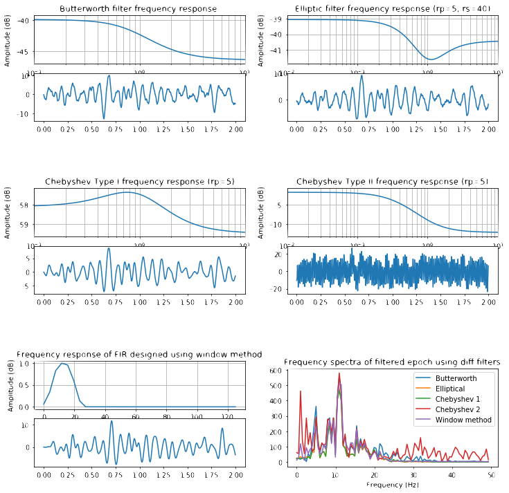
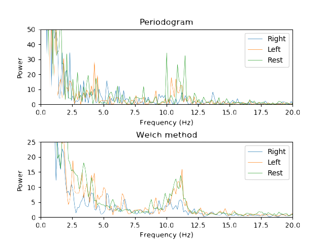
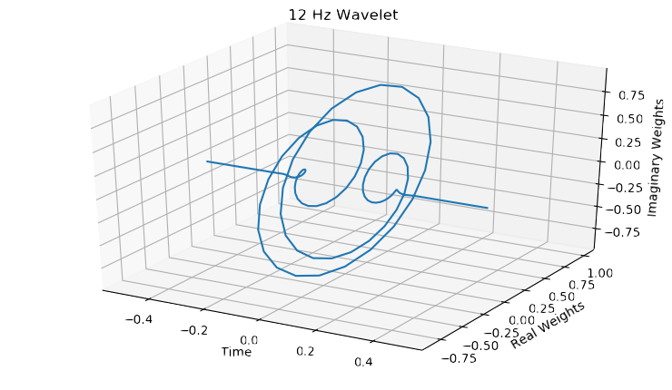

# Signal processing

## Dependencies
* [Python 3.6](https://www.python.org/download/releases/2.7/) or later
* [Numpy 1.16](http://www.numpy.org/) or later
* [Matplotlib 3.0.3](https://matplotlib.org/) or later
* [Pandas 0.23.0](https://pandas.pydata.org) or later
* [mne](https://martinos.org/mne/stable/index.html)

## EEG problems
Problems associated with EEG is that it is noisy, non-stationary, and complex. 

### Filtering
As seen in `/initial/kk_preprocessing.py` and `/test/filters_test.py`, we explored different Finite Impulse Response (FIR) and Infinite Impulse Response (IIR) filters. Examples of IIR filters include Butterworth, Chebyshev Type I and II and Elliptic.
Because Infinite impulse response (IIR) filters are known to be more optimal than FIR filters for digital signal processing, 
we decided to focus on IIR filters. 

  We also explored different filter orders. We recommended the use of a second-order zero-phase Butterworth filter because of the  passband and stopbands being the maximially flat between all the filters. To remove power line noises, we notch 
filtered the EEG signal at 60 Hz. We then proceeded to bandpass filter the signal between 1 and 40 Hz, which corresponds to the band of interest. 

### Feature extraction
Spatial features consisted of isolating channels of interest. In our case, imagined right/left hand movements 
are isolated at electrodes localized over the motor cortex areas of the brain ( for example, around locations C3 and C4 
for right and  left hand movements respectively). To obtain spectral features, as demonstrated in `/real-time/RT.py`, we computed the signal power through the power spectral density (PSD).  To do so, we explored two different methods, including the periodogram and Welch's method. While the Welch PSD leads to smoother plots, the peridogram described the data more accurately.

The spectral features therefore consisted of obtaining mean PSD values at frequencies of interest 
(μ band from about 8 − 13 Hz ).

### Wavelet
We also tentatively explored the possibility of using Morlet wavelet transforms to process the raw EEG signal, as seen in `/wavelet`
 

### Heart rate transforms
The peaks were determined through a peak detection algorithm (in the figure below, the peaks are marked with an orange x) . The RR intervals were obtained via the distance between the peaks. The heart rate was subsquently determined from the mean RR intervals. The code to detect heart rate can be found in `/heart-rate/heart_rate.py` . 
 

